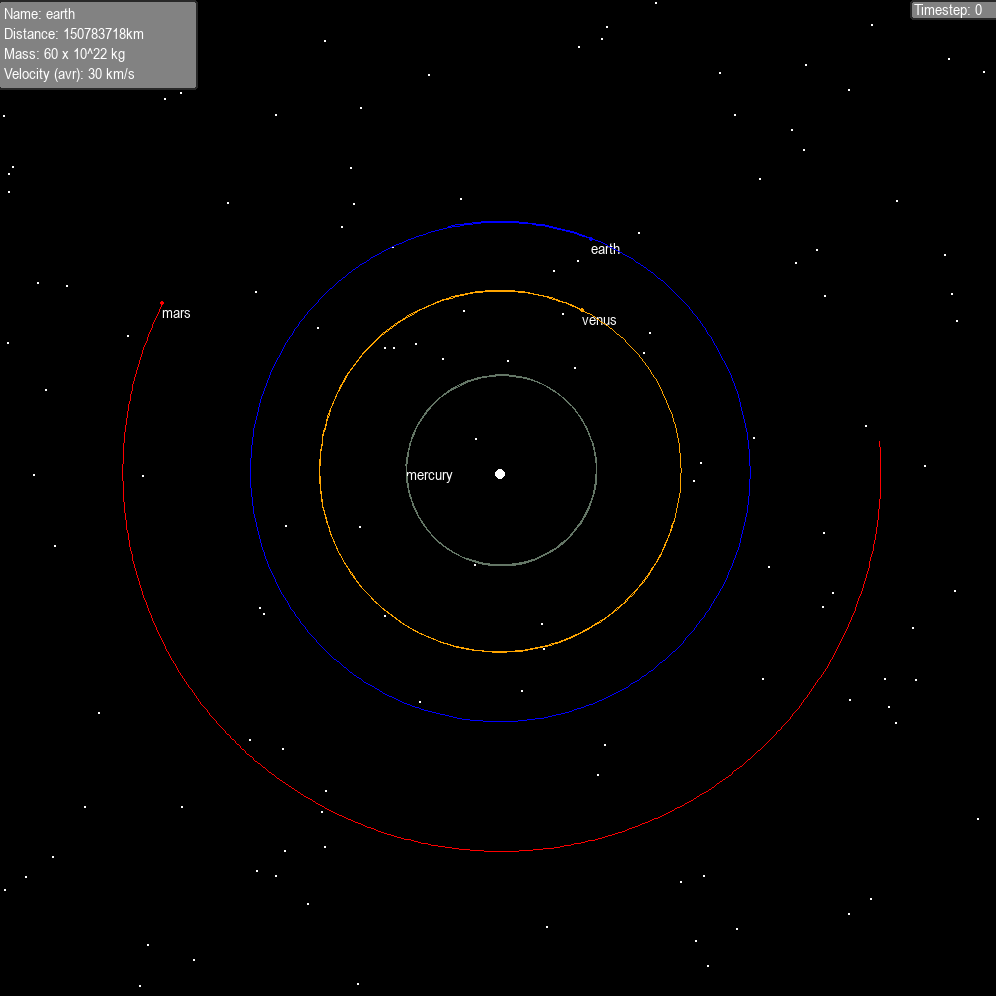
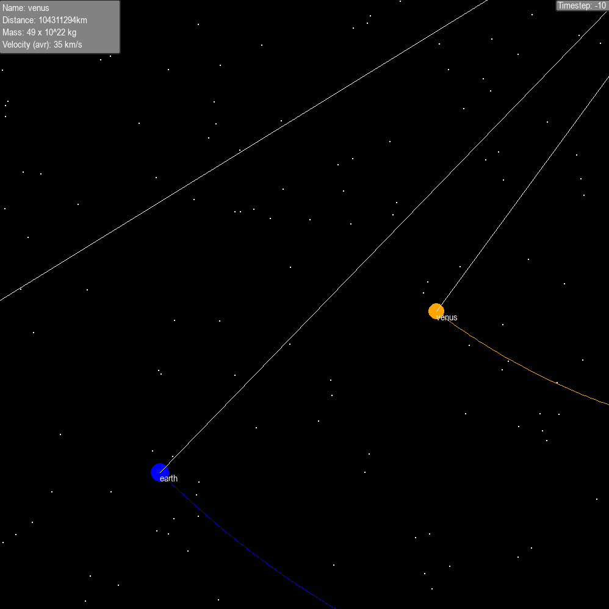
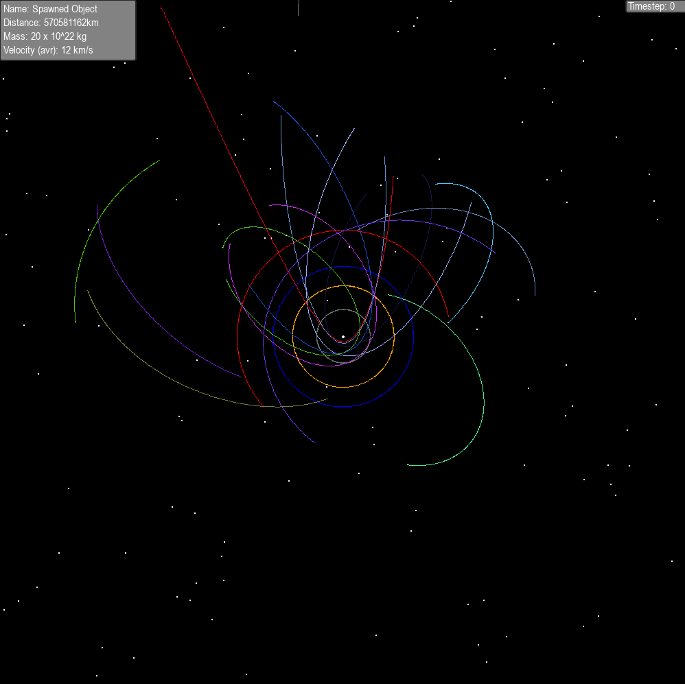

<a name="readme-top"></a>
[](https://choosealicense.com/licenses/mit/)


#

<div align="center">
  <a href="https://github.com/mwkm00/solar-system-simulation">
    
  </a>

  <h3 align="center">Solar System Simulation</h3>

  <p align="center">
    A small project recreating and simulating our solar system with real-life distances, radiuses and masses.
    <br />
    <a href="https://github.com/mwkm00/solar-system-simulation"><strong>Explore readme »</strong></a>
    <br />
    <br />
    <a href="https://github.com/mwkm00/solar-system-simulation/issues">Go to issues »</a>
  </p>
</div>

## Installation

_This project requires Python and Pygame._

1. Clone the repository: 
   ```sh
   git clone https://github.com/mwkm00/solar-system-simulation.git
   ```
2. Install Python: 
   ```bash
   sudo apt install python3
   ```
   (optional) install a fresh Python Virtual Enviroment:
   ```bash
   python -m venv .venv
   ```
3. Install pygame: 
   ```bash
   pip install pygame
   ```
   or if you want the recommended version for the project:
   ```bash
   pip install -r requirements.txt
   ```
<p align="right">(<a href="#readme-top">back to top</a>)</p> 

## Usage
   Run the project: 
   ```bash
   python solar-sim.py
   ```
   Use the WASD keys to move the camera    
   Press H to show the help menu while running.

## Screenshots
  <a href="https://github.com/mwkm00/solar-system-simulation">
    
  </a>
    <a href="https://github.com/mwkm00/solar-system-simulation">
    
  </a>
    <a href="https://github.com/mwkm00/solar-system-simulation">
    
  </a>

<p align="right">(<a href="#readme-top">back to top</a>)</p>

## License

Distributed under the <a href="https://choosealicense.com/licenses/mit/">MIT License</a>.

<p align="right">(<a href="#readme-top">back to top</a>)</p> 